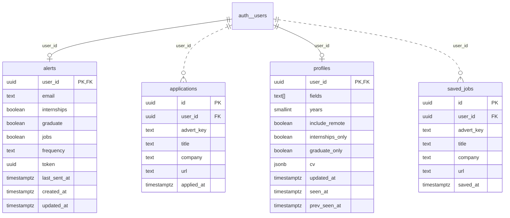

<!-- Generated by diagram-regenerator. Edit descriptions, not this file. -->
# Database schema

**4 tables · 34 columns** · source `schema.sql` · fingerprint `f8a3187652fa`

> Regenerate with `diagram-regen generate`. Column descriptions come from database comments and the descriptions file; rows marked _draft_ were suggested automatically and await review.

## Contents

- [Entity-relationship diagram](#entity-relationship-diagram)
- [Tables](#tables): [alerts](#alerts) · [applications](#applications) · [profiles](#profiles) · [saved_jobs](#saved_jobs)

## Entity-relationship diagram

## Tables

### alerts

| Column | Type | Nullable | Default | Keys | Description |
| --- | --- | --- | --- | --- | --- |
| `user_id` | `uuid` |  |  | PK FK → `auth.users`.`id` (cascade on delete) |  |
| `email` | `text` |  |  |  |  |
| `internships` | `boolean` |  | `false` |  |  |
| `graduate` | `boolean` |  | `false` |  |  |
| `jobs` | `boolean` |  | `false` |  |  |
| `frequency` | `text` |  | `'daily'` |  |  |
| `token` | `uuid` |  | `gen_random_uuid()` |  |  |
| `last_sent_at` | `timestamptz` | yes |  |  |  |
| `created_at` | `timestamptz` |  | `current_timestamp` |  |  |
| `updated_at` | `timestamptz` |  | `current_timestamp` |  |  |

### applications

| Column | Type | Nullable | Default | Keys | Description |
| --- | --- | --- | --- | --- | --- |
| `id` | `uuid` |  | `gen_random_uuid()` | PK |  |
| `user_id` | `uuid` |  |  | FK → `auth.users`.`id` (cascade on delete) |  |
| `advert_key` | `text` |  |  |  |  |
| `title` | `text` |  |  |  |  |
| `company` | `text` |  |  |  |  |
| `url` | `text` |  |  |  |  |
| `applied_at` | `timestamptz` |  | `current_timestamp` |  |  |

**Indexes:** unique `applications_user_id_advert_key_key` (`user_id`, `advert_key`) · `applications_user_applied_at_idx` (`user_id`, `applied_at`)

### profiles

| Column | Type | Nullable | Default | Keys | Description |
| --- | --- | --- | --- | --- | --- |
| `user_id` | `uuid` |  |  | PK FK → `auth.users`.`id` (cascade on delete) |  |
| `fields` | `text[]` |  | `'{}'` |  |  |
| `years` | `smallint` | yes |  |  |  |
| `include_remote` | `boolean` |  | `false` |  |  |
| `internships_only` | `boolean` |  | `false` |  |  |
| `graduate_only` | `boolean` |  | `false` |  |  |
| `cv` | `jsonb` | yes |  |  |  |
| `updated_at` | `timestamptz` |  | `current_timestamp` |  |  |
| `seen_at` | `timestamptz` | yes |  |  |  |
| `prev_seen_at` | `timestamptz` | yes |  |  |  |

### saved_jobs

| Column | Type | Nullable | Default | Keys | Description |
| --- | --- | --- | --- | --- | --- |
| `id` | `uuid` |  | `gen_random_uuid()` | PK |  |
| `user_id` | `uuid` |  |  | FK → `auth.users`.`id` (cascade on delete) |  |
| `advert_key` | `text` |  |  |  |  |
| `title` | `text` |  |  |  |  |
| `company` | `text` |  |  |  |  |
| `url` | `text` |  |  |  |  |
| `saved_at` | `timestamptz` |  | `current_timestamp` |  |  |

**Indexes:** unique `saved_jobs_user_id_advert_key_key` (`user_id`, `advert_key`) · `saved_jobs_user_saved_at_idx` (`user_id`, `saved_at`)
